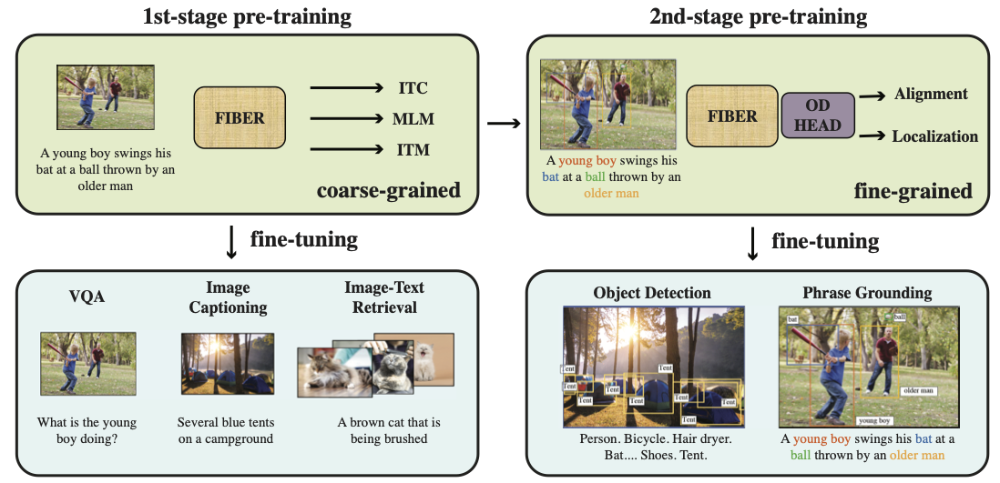

# Coarse-to-Fine Vision-Language Pre-training with Fusion in the Backbone



## Introduction

This repository is the project page for [FIBER](), which is pre-trained with a coarse-to-fine strategy and supports a variety of tasks.

We provide code for both **coarse-grained** and **fine-grained** pre-training and fine-tuning of FIBER. Please see respective directories for instructions.

## Model Performance

**Coarse-grained Checkpoint**
<table border="1" width="100%">
    <tr align="center">
        <th>Task</th><th>VQAv2</th><th>NLVR2</th><th>F30k Retrieval</th><th>COCO Retrieval</th><th>COCO Captioning</th>
    </tr>
    <tr align="center">
        <td>Split</td><td>test-std</td><td>test-P</td><td>test</td><td>Karpathy test</td><td>Karpathy test</td>
    </tr>
    <tr align="center">
        <td>Metric</td><td>VQA Score</td><td>Acc.</td><td>IR@1/TR@1</td><td>IR@1/TR@1</td><td>CIDEr</td>
    </tr>
    <tr align="center">
        <td>FIBER-Base</td><td>78.46</td><td>85.52</td><td>81.44/92.90 (ITC) 84.10/95.10 (ITM)</td><td>58.01/75.38 (ITC) 59.03/75.14 (ITM)</td><td>144.4</td>
    </tr>
</table>

**Fine-grained Checkpoint**
<table border="1" width="100%">
    <tr align="center">
        <th>Task</th><th>F30k Grounding</th><th>RefCOCO</th><th>RefCOCO+</th><th>RefCOCOg</th><th>COCO Detection</th><th>LVIS</th><th>ODinW</th>
    </tr>
    <tr align="center">
        <td>Split</td><td>test</td><td>val/testA/testB</td><td>val/testA/testB</td><td>val/test</td><td>Val 2017</td><td>MiniVal</td><td>13 Datasets</td>
    </tr>
    <tr align="center">
        <td>Metric</td><td>R@1/R@5/R@10</td><td>Acc.</td><td>Acc.</td><td>Acc.</td><td>Zero-shot/Fine-tune AP</td><td>Zero-shot/Fine-tune AP</td><td>Avg. Zero-shot/Fine-tune AP</td>
    </tr>
    <tr align="center">
        <td>FIBER-Base</td><td>87.4/96.4/97.6</td><td>90.68/92.59/87.26</td><td>85.74/90.13/79.38</td><td>87.11/87.32</td><td>49.3/58.4</td><td>35.8/56.9</td><td>47.0/65.9</td>
    </tr>
</table>


## Citation
```
@article{fiber2022,
  title={Coarse-to-Fine Vision-Language Pre-training with Fusion in the Backbone},
  author={Dou, Zi-Yi* and Kamath, Aishwarya* and Gan, Zhe* and Zhang, Pengchuan and Wang, Jianfeng and Li, Linjie and Liu, Zicheng and Liu, Ce and LeCun, Yann and Peng, Nanyun and Gao, Jianfeng and Wang, Lijuan},
  journal={arXiv},
  year={2022},
}
```

## Contributing

This project welcomes contributions and suggestions.  Most contributions require you to agree to a
Contributor License Agreement (CLA) declaring that you have the right to, and actually do, grant us
the rights to use your contribution. For details, visit https://cla.opensource.microsoft.com.

When you submit a pull request, a CLA bot will automatically determine whether you need to provide
a CLA and decorate the PR appropriately (e.g., status check, comment). Simply follow the instructions
provided by the bot. You will only need to do this once across all repos using our CLA.

This project has adopted the [Microsoft Open Source Code of Conduct](https://opensource.microsoft.com/codeofconduct/).
For more information see the [Code of Conduct FAQ](https://opensource.microsoft.com/codeofconduct/faq/) or
contact [opencode@microsoft.com](mailto:opencode@microsoft.com) with any additional questions or comments.

## Trademarks

This project may contain trademarks or logos for projects, products, or services. Authorized use of Microsoft 
trademarks or logos is subject to and must follow 
[Microsoft's Trademark & Brand Guidelines](https://www.microsoft.com/en-us/legal/intellectualproperty/trademarks/usage/general).
Use of Microsoft trademarks or logos in modified versions of this project must not cause confusion or imply Microsoft sponsorship.
Any use of third-party trademarks or logos are subject to those third-party's policies.
